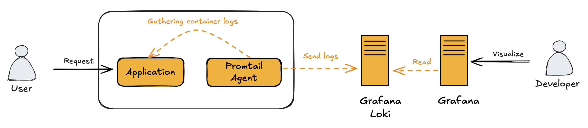
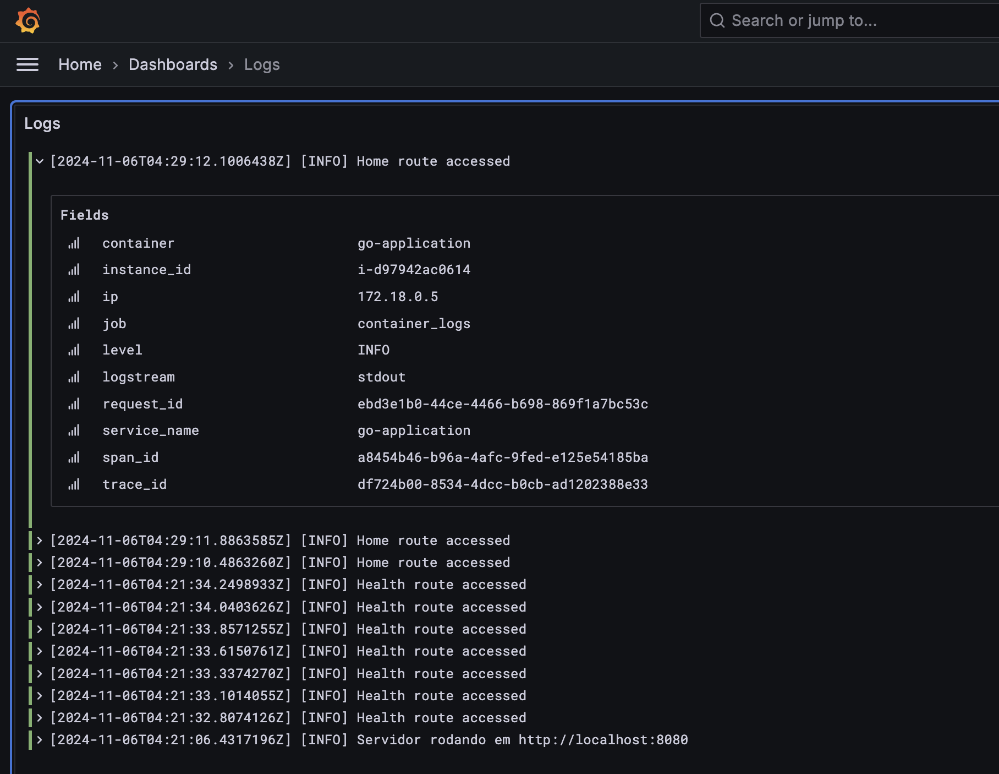
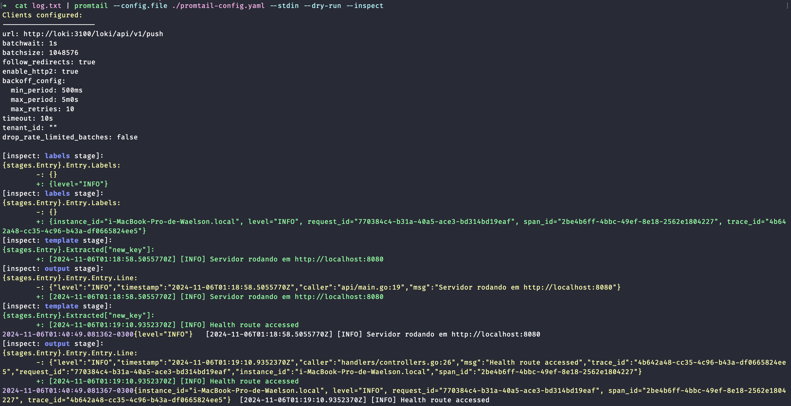

# Go + Uber Zap + Promtail + Loki + Grafana


### Solução
A proposta deste projeto é desenvolver uma solução abrangente, tanto em nível de aplicação quanto em nível de infraestrutura, que implemente as melhores práticas de observabilidade (o11y) no que diz respeito ao pilar de Logs.

Essa solução é composta pela biblioteca de logs `Zap`, do Uber, além do `Promtail`, `Grafana Loki` e `Grafana`, formando um conjunto integrado para coleta, processamento, armazenamento e visualização de logs.

### Arquitetura
A arquitetura proposta permite uma solução escalável e eficiente de observabilidade para logs. 
O Promtail atua como um agente leve de coleta de logs, enquanto o Grafana Loki armazena e indexa os logs de forma otimizada. 
O Grafana fornece uma interface rica para consulta e visualização, permitindo que desenvolvedores monitorem o sistema e identifiquem problemas rapidamente. 
Essa arquitetura é especialmente adequada para ambientes de contêineres e sistemas distribuídos onde a observabilidade é essencial para manter a estabilidade e a saúde do sistema.



#### Componentes
1. **`Application (Aplicação)`**: A aplicação é o componente que gera logs em resposta às requisições dos usuários. Esses logs contêm informações essenciais para monitoramento, depuração e auditoria do sistema.

2. **`Promtail Agent`**: O Promtail atua como um agente de coleta de logs. Ele é responsável por:
   - Coletar Logs da Aplicação: O Promtail acessa os logs gerados pela aplicação (no caso de contêineres, ele pode ler diretamente dos logs do contêiner).
   - Enviar Logs para o Grafana Loki: Após coletar os logs, o Promtail os envia para o Grafana Loki, onde serão armazenados e indexados.

3. **`Grafana Loki`**: O Grafana Loki é uma solução de armazenamento de logs otimizada para funcionar junto com o Grafana. Ele atua como um sistema de banco de dados para logs, sendo responsável por:
   - Armazenar e Indexar os Logs: Loki recebe os logs enviados pelo Promtail, indexa os campos principais e armazena os logs de forma eficiente.
   Fornecer Logs para o Grafana: O Loki permite que o Grafana realize consultas nos logs armazenados para exibição e análise.

4. **`Grafana`**: O Grafana é a interface de visualização onde os desenvolvedores podem:
   - Consultar e Visualizar os Logs: O Grafana permite que desenvolvedores façam buscas específicas nos logs (como por trace_id, service_name e level) para monitoramento e depuração.
   - Criar Painéis de Observabilidade: Além dos logs, o Grafana pode integrar outras métricas e fontes de dados para fornecer uma visão completa da saúde e performance do sistema.

### Visualização de logs
O log exibido no Grafana mostra informações detalhadas sobre as requisição feitas à aplicação. 
Cada entrada de log está estruturada e inclui os seguintes campos, que facilitam a análise e rastreamento de eventos na aplicação:

- **`container`**: Identifica o contêiner onde a aplicação está rodando, neste caso, go-application.
- **`instance_id`**: Um identificador único da instância, como i-d97942ac0614, que ajuda a rastrear eventos em instâncias específicas dentro de um ambiente distribuído.
- **`ip`**: Endereço IP da instância, como 172.18.0.5, que facilita a localização da origem do log em redes complexas.
- **`job`**: Nome do job de coleta configurado no Promtail, aqui definido como container_logs, indicando a fonte dos logs para categorização e filtragem.
- **`logstream`**: Identifica o fluxo de log, neste caso stdout, que indica que a saída padrão está sendo usada para captura dos logs.
- **`request_id`**: Um identificador único para a requisição, ebd3e1b0-44ce-4466-b698-869f1a7bc53c, que permite correlacionar todas as entradas de log associadas a uma única requisição.
- **`service_name`**: Nome do serviço, go-application, que ajuda a identificar a origem do log quando múltiplos serviços estão sendo monitorados.
- **`span_id e trace_id`**: Identificadores para rastreamento distribuído, como a8454b46-b96a-4afc-9fed-e125e54185ba (span) e df724b80-8534-4dcc-b0cb-ad1202388e33 (trace). Esses identificadores permitem rastrear a jornada completa de uma requisição através de diferentes serviços e componentes.



### Executando
A aplicação está configurada para ser executada com Docker Compose. Para iniciá-la, entre no diretório raiz da aplicação e execute o seguinte comando:

```bash
docker-compose up --build
```

### Promtail
O Promtail permite realizar experimentos, validações e alterações nos logs enviados para o Grafana Loki sem a 
necessidade de inicializar o servidor. Para instalar o Promtail localmente, utilize o seguinte comando:

```bash
brew install promtail
```

Para fins de teste, insira logs no arquivo `config/log.txt` e execute o comando abaixo para validar o formato dos logs:

```bash
cat log.txt | promtail --config.file ./promtail-config.yaml --stdin --dry-run --inspect
```

Este comando lê o conteúdo de `log.txt` e executa o Promtail em modo de teste (--dry-run), exibindo informações detalhadas sobre o processamento dos logs sem enviá-los ao Loki. Assim, você pode inspecionar e ajustar o formato dos logs antes de enviá-los para produção.

#### Explicação
- **`--stdin`**: Lê a entrada diretamente do stdin em vez de um arquivo.
- **`--dry-run`**: Executa o Promtail em modo de teste, o que significa que os logs são processados, mas não enviados ao Loki.
- **`--inspect`**: Fornece uma saída detalhada sobre o processamento de cada entrada de log, ajudando a identificar problemas de formatação ou incompatibilidades de configuração.
  Essa configuração permite que você inspecione e ajuste o formato dos seus logs localmente antes de enviá-los para o ambiente de produção do Loki.

#### Exemplo de Fluxo de Trabalho
1. Edite `config/log.txt` para incluir logs de exemplo.
2. Ajuste `promtail-config.yaml` conforme necessário para análise e rotulagem dos logs.
3. Execute o comando acima para ver a saída detalhada e garantir que tudo esteja configurado corretamente.

Happy logging!

